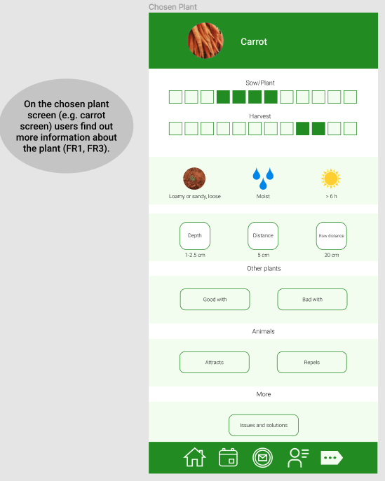
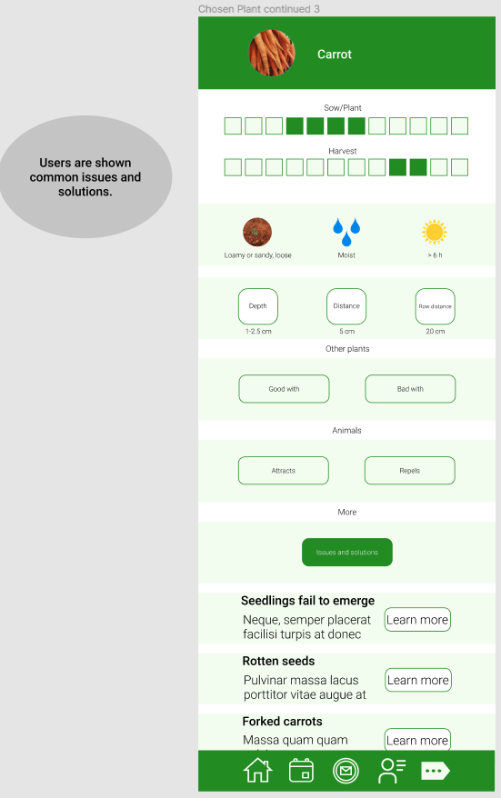
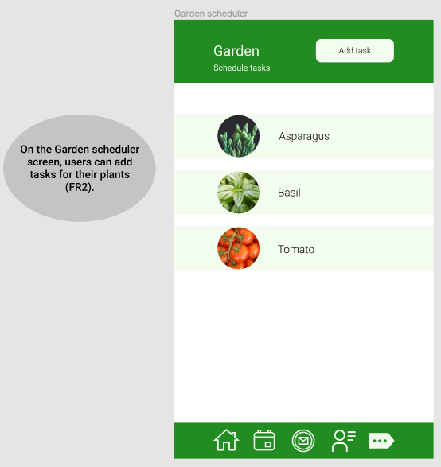

# Permaculture mobile app design

The application would help people plan, grow, and maintain their own permaculture gardens.

## App description
Are you are interested in planning, growing, and maintaining your own garden in harmony with nature? Do you want to follow the ethical pillars of permaculture of caring for our planet, caring for people, and sharing fairly? \
Design your own garden – just enter the plants you wish to grow, and the app will show you the possible combinations! Some plants make friendlier roommates than others and some insects can be repelled by different plants. \
Learn about the sowing (or planting), water, sun and soil needs of the plants and use this information to make your own garden flourish! Plants can sometimes fall ill, so there will be some solutions provided for you. \
Schedule tasks and connect with your neighbours. Perhaps they are interested in exchanging some seeds or organising an educational seminar. 

## UI Design
Designed with [Figma](https://www.figma.com/).
Photos from [Unsplash](https://unsplash.com/).
#### Home 
 
#### Plant search 
 
##### Chosen plant
 
##### Chosen plant continued
 
##### Chosen plant continued 2
 
##### Chosen plant continued 3
 
#### Animal search 
 
#### Garden 
 
##### Garden combos
 
##### Garden scheduler
 
#### Community 
 

